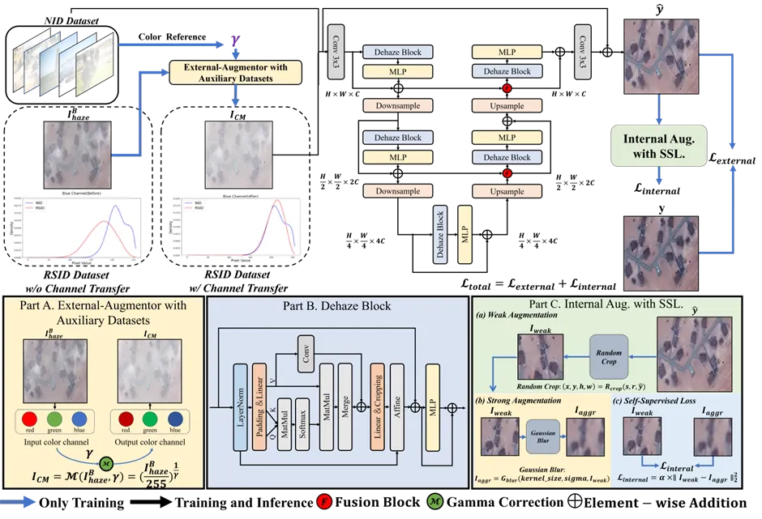
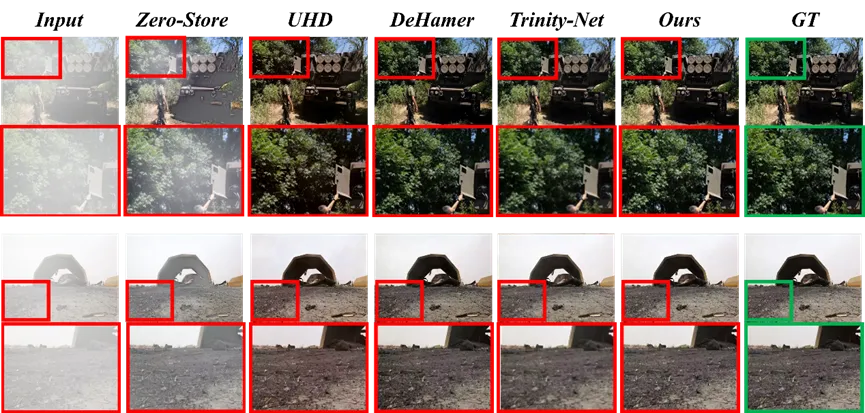
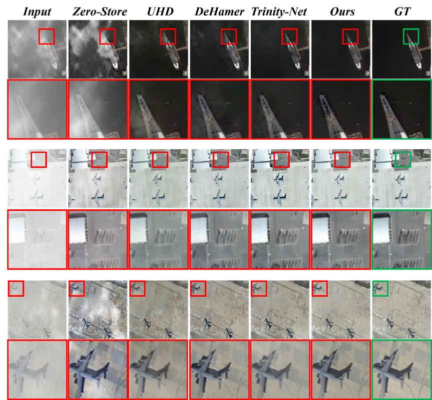

# CrossDehaze: Scaling Up Image Dehazing with Cross-Data Vision Alignment and Augmentation
### Overview


**Abstract:** 
In recent years, as computer vision tasks have increasingly relied on high-quality image inputs, the task of image dehazing has received significant attention.
Previously, many methods based on priors and deep learning have been proposed to address the task of image dehazing.
Ignoring the domain gap between different data, former de-hazing methods usually adopt multiple datasets for explicit training, which often makes the methods themselves be violated. To address this problem, we
propose a novel method of internal and external data augmen-
tation to improve the existing dehazing methodology. By using
cross-data external augmentor. The dataset inherits samples from
different domains that are firmly aligned, making the model learn
more robust and generalizable features. By using the internal
data augmentation method, the model can fully exploit local
information within the images, thereby obtaining more image
details. To demonstrate the effectiveness of our proposed method,
we conduct training on both the Natural Image Dataset (NID) and
the Remote Sensing Image Dataset (RSID). Experimental results
show that our method clearly resolves the domain gap in different
dehazing datasets and presents a new pipeline for joint training in
the dehazing task. Our approach significantly outperforms other
advanced methods in dehazing and produces dehazed images that
are closest to real haze-free images.

### Visual



## Preparation

### Install

We test the code on PyTorch 1.10.2 + CUDA 11.3.

1. Create a new conda environment
```
conda create -n scaleupdehazing python=3.7
conda activate scaleupdehazing
```

2. Install dependencies
```
conda install pytorch=1.10.2 torchvision torchaudio cudatoolkit=11.3 -c pytorch
pip install -r requirements.txt
```

### Download

You can download the pretrained models on [[Baidu Drive](https://pan.baidu.com/s/1HPFKJaZ79dsSXOpXxie-7Q?pwd=1234)]


The file path should be the same as the following:

```
┬─ save_models
│   ├─ nid
│   │   ├─ scaleupdehazing.pth
│   │   └─ ... (model name)
│   └─ ... (exp name)
└─ data
    ├─ NID
    │   ├─ train
    │   │   ├─ GT
    │   │   │   └─ ... (image filename)
    │   │   └─ hazy
    │   │       └─ ... (corresponds to the former)
    │   └─ test
    │       └─ ...
    └─ ... (dataset name)
```


### Train
You can obtain the image after channel transfer using the following command line:
```sh
python ct.py
```
You can modify the training settings for each experiment in the `configs` folder.
Then run the following script to train the model:

```sh
python train_ct.py --model scaleupdehazing --dataset NID --exp nid
```
Then you have obtained an initial pre-trained model. We will continue to perform self-supervised training on the obtained model.

```sh
python train_ssl.py --model scaleupdehazing --dataset NID --exp nid
```

### Test

Run the following script to test the trained model:

```sh
python test.py --model scaleupdehazing --dataset NID --exp nid
```

## Acknowledgement
This project is build based on [Dehazeformer](https://github.com/IDKiro/DehazeFormer). We thank the authors for sharing their code.
